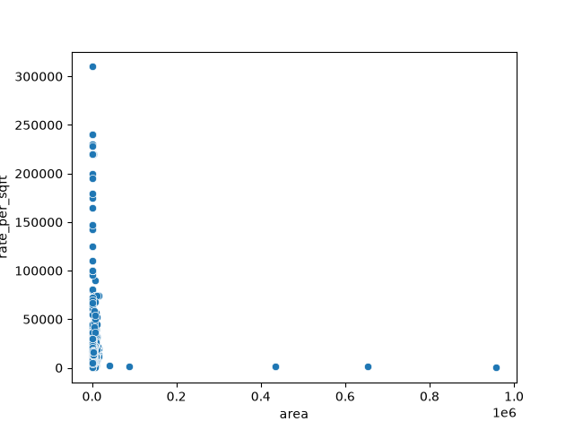

# Gurugram Real Estate Market Analysis

A data analysis project exploring residential real estate listings in Gurugram (Gurgaon), India. The project cleans a raw listings dataset and answers a series of business questions about pricing, locality trends, RERA approval, builder pricing, and the relationship between area and price.

## Dataset

The dataset (`data of gurugram real Estate.csv`) contains ~19,500 property listings with the following fields:

| Column | Description |
|---|---|
| `Price` | Listed price of the property (INR) |
| `Status` | Ready to move / Under construction |
| `Area` | Area in square feet |
| `Rate per sqft` | Price per square foot (INR) |
| `Property Type` | Full listing title (includes BHK & type) |
| `Locality` | Sector / locality in Gurugram |
| `Builder Name` | Name of the builder or listing agent |
| `RERA Approval` | RERA approval status |
| `BHK_Count` | Number of bedrooms |
| `Society` | Housing society / project name |
| `Company Name` | Developer / company |
| `Flat Type` | Apartment, Floor, Plot, etc. |

> **Note:** Raw data is not committed to this repository (see `.gitignore`). Place your copy of the CSV in the project root before running the script, or update the path in `main.py`.

## What the analysis covers

`main.py` loads and cleans the raw data (standardizing column names, fixing numeric fields, normalizing categorical text) and then answers:

1. Which is the costliest flat in the dataset?
2. Which locality has the highest average price?
3. Which locality has the highest average rate per sqft?
4. Do ready-to-move properties cost more than under-construction ones?
5. Do RERA-approved properties command a price premium?
6. How does area impact price (correlation)?
7. Which BHK configuration is the most expensive on average?
8. Which property type (Apartment / Floor / Plot) is the costliest on average?
9. Do certain builders or companies consistently price higher?
10. Are larger homes always more expensive per square foot? (visualized with a scatter plot)

## Sample output



*Rate per sqft tends to fall as area increases — smaller units command a higher price per square foot than very large plots.*

## Getting started

### Prerequisites

- Python 3.8+
- pandas
- matplotlib
- seaborn

### Installation

```bash
git clone https://github.com/<your-username>/Gurugram_Real_Estate_Market_Analysis.git
cd Gurugram_Real_Estate_Market_Analysis
pip install -r requirements.txt
```

### Usage

Place `data of gurugram real Estate.csv` in the project root, then run:

```bash
python main.py
```

This prints the answers to each question to the console and displays a scatter plot of area vs. rate per sqft.

## Project structure

```
.
├── main.py            # Data cleaning + analysis script
├── requirements.txt    # Python dependencies
├── README.md
├── LICENSE
└── .gitignore
```

## Future improvements

- Convert the console-based analysis into a Jupyter notebook with inline visualizations
- Add more charts (price distribution, locality comparisons, builder rankings)
- Build an interactive dashboard (Streamlit/Power BI)

## License

This project is licensed under the MIT License — see the [LICENSE](LICENSE) file for details.
